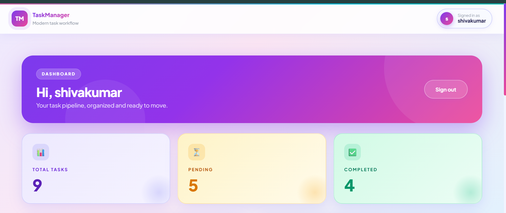
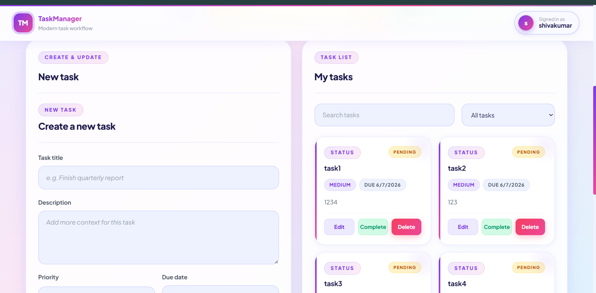
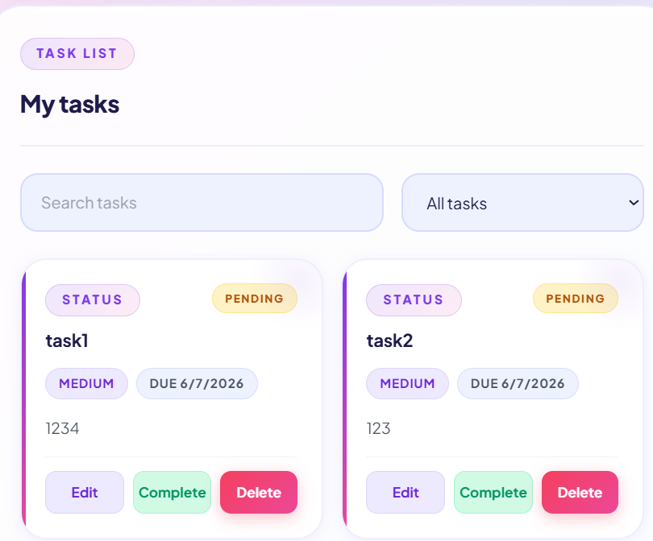
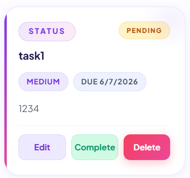
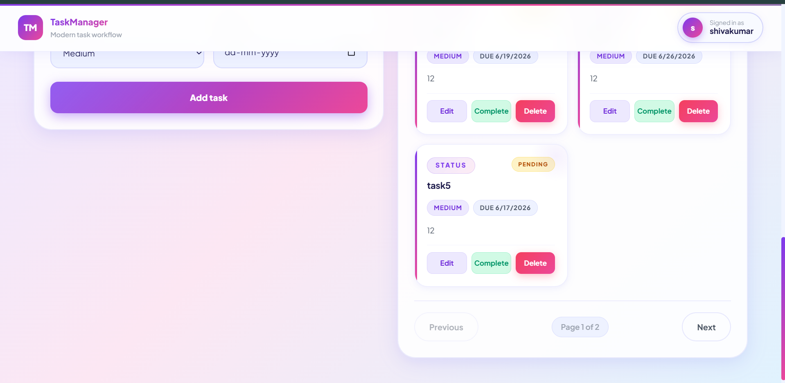

# 🚀 TaskMaster Pro

A modern full-stack task management application built with the **MERN Stack (MongoDB, Express.js, React.js, Node.js)**. TaskMaster Pro helps users organize, track, and manage tasks efficiently through a clean, responsive, and secure interface.



---

## ✨ Features

### 🔐 Authentication & Security

* User Registration
* User Login
* JWT Authentication
* Protected Routes
* Password Hashing with bcrypt
* Rate Limiting
* Helmet Security Headers
* CORS Protection

### 📋 Task Management

* Create Tasks
* Update Tasks
* Delete Tasks
* Mark Tasks as Completed
* Task Priority Levels
* Due Date Tracking

### 📊 Productivity Features

* Dashboard Analytics
* Search Tasks
* Filter Tasks by Status
* Pagination
* Responsive Design

---

## 🛠️ Tech Stack

### Frontend

* React.js
* Vite
* React Router DOM
* Axios
* React Toastify
* CSS3

### Backend

* Node.js
* Express.js
* MongoDB
* Mongoose

### Authentication

* JWT (JSON Web Tokens)
* bcryptjs

### Security

* Helmet
* Express Rate Limit
* CORS

---

## 📸 Screenshots

### Login Page


Secure authentication interface for registered users.

---

### Registration Page


New users can create an account and access the platform.

---

### Dashboard Overview


Overview of task statistics including total, pending, and completed tasks.

---

### Create Task



Create tasks with title, description, priority, and due date.

---

### Search & Filter Tasks



Quickly find tasks using search and filtering functionality.

---

### Task Operations



Edit, complete, and delete tasks directly from task cards.

---

### Pagination



Navigate through multiple pages of tasks efficiently.

---

## 📂 Project Structure

```text
TaskManagement
│
├── Backend
│   ├── src
│   │   ├── config
│   │   ├── controllers
│   │   ├── middleware
│   │   ├── models
│   │   ├── routes
│   │   └── validation
│   ├── index.js
│   └── package.json
│
├── Frontend
│   ├── src
│   │   ├── api
│   │   ├── components
│   │   ├── pages
│   │   ├── styles
│   │   └── App.jsx
│   └── package.json
│
└── README.md
```

---

## 🔗 API Endpoints

### Authentication

| Method | Endpoint             | Description         |
| ------ | -------------------- | ------------------- |
| POST   | `/api/auth/register` | Register a new user |
| POST   | `/api/auth/login`    | Authenticate user   |

### Tasks

| Method | Endpoint                  | Description            |
| ------ | ------------------------- | ---------------------- |
| GET    | `/api/tasks`              | Get all tasks          |
| POST   | `/api/tasks`              | Create task            |
| PUT    | `/api/tasks/:id`          | Update task            |
| DELETE | `/api/tasks/:id`          | Delete task            |
| PATCH  | `/api/tasks/:id/complete` | Mark task as completed |

---

## ⚙️ Installation & Setup

### Clone Repository

```bash
git clone https://github.com/Shiva132007/Task_Management.git
cd Task_Management
```

### Backend Setup

```bash
cd Backend
npm install
```

Create a `.env` file:

```env
MONGO_URI=your_mongodb_connection_string
JWT_SECRET=your_secret_key
PORT=3000
```

Start the backend server:

```bash
npm run dev
```

---

### Frontend Setup

```bash
cd Frontend
npm install
npm run dev
```

Open:

```text
http://localhost:5173
```

---

## 🎯 Learning Outcomes

This project helped strengthen skills in:

* MERN Stack Development
* REST API Design
* Authentication & Authorization
* MongoDB Data Modeling
* CRUD Operations
* Secure Backend Development
* React Component Architecture
* State Management
* Responsive UI Development

---

## 🚀 Future Enhancements

* Dark Mode
* Drag & Drop Tasks
* Task Categories & Tags
* Team Collaboration
* Email Notifications
* Activity Logs
* Real-Time Updates using WebSockets

---

## 👨‍💻 Author

**G.SHIVA KUMAR**

Aspiring Full-Stack Developer focused on building scalable and user-friendly web applications using the MERN Stack.

* GitHub: https://github.com/Shiva132007
* LinkedIn: www.linkedin.com/in/shivakumargolladasari

---

## 📄 License

This project is licensed under the ISC License.
