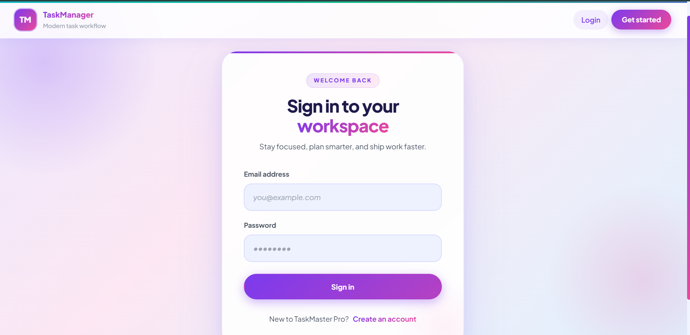
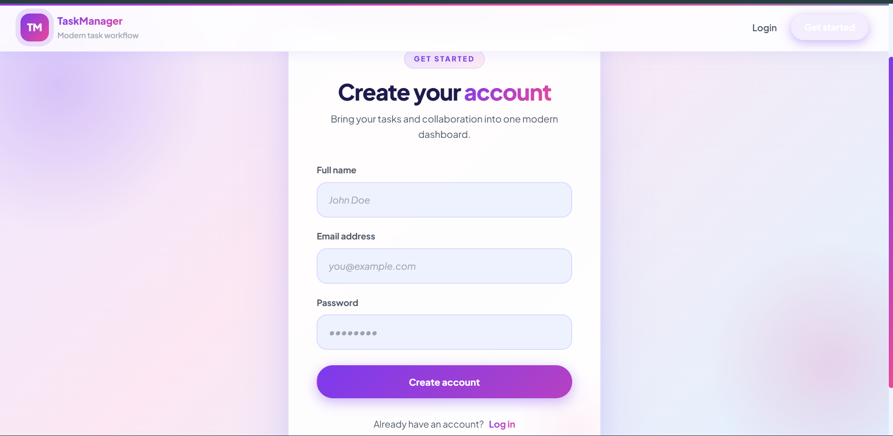

# 🚀 TaskMaster Pro

A modern full-stack Task Management application built with the **MERN Stack (MongoDB, Express.js, React.js, Node.js)**. TaskMaster Pro helps users organize, track, and manage tasks efficiently through a secure, responsive, and intuitive interface.


## 🌐 Live Demo

**Frontend:** https://task-management-git-main-shiva132007s-projects.vercel.app

**Backend API:** https://task-management-jerp.onrender.com

**GitHub Repository:** https://github.com/Shiva132007/Task_Management

---

## ✨ Features

### 🔐 Authentication & Security

* User Registration
* User Login
* JWT Authentication
* Protected Routes
* Password Hashing using bcryptjs
* Rate Limiting
* Helmet Security Headers
* CORS Protection

### 📋 Task Management

* Create Tasks
* Update Tasks
* Delete Tasks
* Toggle Task Status (Pending / Completed)
* View All Tasks
* Task Ownership & User Isolation

### 📊 Productivity Features

* Search Tasks
* Filter Tasks by Status
* Pagination
* Responsive Dashboard
* Real-Time Task Updates on UI

---

## 🛠️ Tech Stack

### Frontend

* React.js
* Vite
* React Router DOM
* Axios
* React Toastify
* CSS3

### Backend

* Node.js
* Express.js
* MongoDB
* Mongoose

### Authentication

* JSON Web Tokens (JWT)
* bcryptjs

### Security

* Helmet
* Express Rate Limit
* CORS

### Deployment

* Frontend: Vercel
* Backend: Render
* Database: MongoDB Atlas

---

## 📸 Screenshots

### Login Page



Secure login interface for registered users.

---

### Registration Page



New users can create an account and access the platform.

---

### Dashboard


Central dashboard displaying user tasks and actions.

---

### Task Creation


Create and manage tasks with ease.

---

### Search & Filter


Quickly locate tasks using search and filter functionality.

---

### Task Operations


Edit, update status, and delete tasks directly from the dashboard.

---

### Pagination


Efficiently navigate large task lists using pagination.

---

## 🏗️ System Architecture

```text
Frontend (React + Vite)
          │
          ▼
       Vercel
          │
          ▼
Backend (Node.js + Express)
          │
          ▼
        Render
          │
          ▼
   MongoDB Atlas
```

---

## 📂 Project Structure

```text
Task_Management
│
├── Backend
│   ├── src
│   │   ├── config
│   │   ├── controllers
│   │   ├── middleware
│   │   ├── models
│   │   ├── routes
│   │   ├── schemas
│   │   └── utils
│   │
│   ├── index.js
│   └── package.json
│
├── Frontend
│   ├── src
│   │   ├── api
│   │   ├── components
│   │   ├── pages
│   │   ├── styles
│   │   ├── App.jsx
│   │   └── main.jsx
│   │
│   └── package.json
│
├── screenshots
│
└── README.md
```

---

## 🔗 API Endpoints

### Authentication

| Method | Endpoint             | Description         |
| ------ | -------------------- | ------------------- |
| POST   | `/api/auth/register` | Register a new user |
| POST   | `/api/auth/login`    | Authenticate user   |

### Tasks

| Method | Endpoint                | Description        |
| ------ | ----------------------- | ------------------ |
| GET    | `/api/tasks`            | Get all user tasks |
| GET    | `/api/tasks/:id`        | Get task by ID     |
| POST   | `/api/tasks`            | Create task        |
| PUT    | `/api/tasks/:id`        | Update task        |
| DELETE | `/api/tasks/:id`        | Delete task        |
| PATCH  | `/api/tasks/:id/status` | Toggle task status |

---

## ⚙️ Local Installation

### Clone Repository

```bash
git clone https://github.com/Shiva132007/Task_Management.git
cd Task_Management
```

---

## Backend Setup

```bash
cd Backend
npm install
```

Create a `.env` file:

```env
MONGO_URI=your_mongodb_connection_string
JWT_SECRET=your_secret_key
PORT=3000
CLIENT_ORIGIN=http://localhost:5173
```

Start backend:

```bash
npm run dev
```

---

## Frontend Setup

```bash
cd Frontend
npm install
```

Create a `.env` file:

```env
VITE_API_BASE_URL=http://localhost:3000/api
```

Start frontend:

```bash
npm run dev
```

Open:

```text
http://localhost:5173
```

---

## 🎯 Learning Outcomes

This project helped strengthen skills in:

* MERN Stack Development
* REST API Design
* Authentication & Authorization
* MongoDB Data Modeling
* CRUD Operations
* Middleware Implementation
* Secure Backend Development
* React Component Architecture
* State Management
* API Integration
* Responsive UI Development
* Deployment using Render & Vercel

---

## 🚀 Future Enhancements

* Dark Mode
* Drag & Drop Tasks
* Task Categories & Tags
* Due Date Notifications
* Team Collaboration
* Activity Logs
* Real-Time Updates using WebSockets
* Task Analytics Dashboard

---

## 👨‍💻 Author

### G. Shiva Kumar

Aspiring Full-Stack Developer focused on building scalable and user-friendly web applications using the MERN Stack.

**GitHub:** https://github.com/Shiva132007

**LinkedIn:** https://www.linkedin.com/in/shivakumargolladasari

---

## 📄 License

This project is licensed under the ISC License.

---

⭐ If you found this project useful, consider giving it a star on GitHub.
